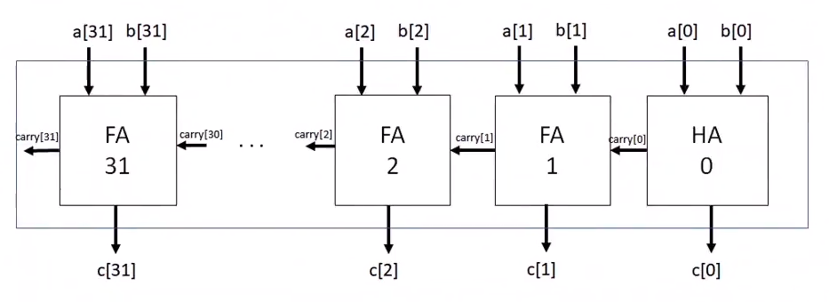
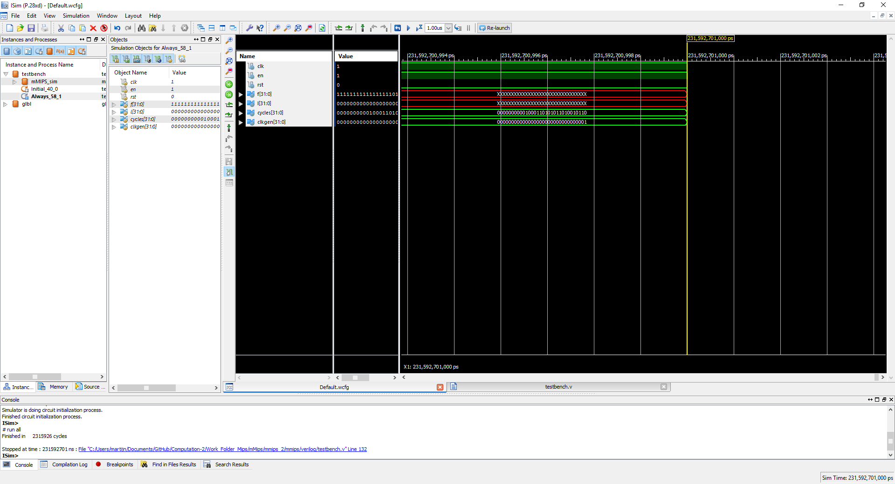
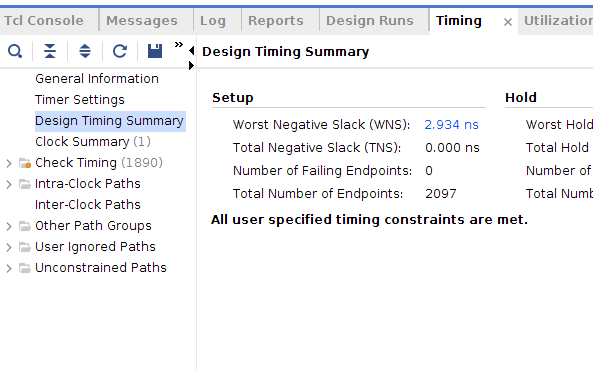

# Computation 2 (5EIB0)

Digital design and computer architecture coursework for the Computation 2 course
(5EIB0) at TU Eindhoven. The work runs on Xilinx hardware: HDL is written mostly in
Verilog, synthesized with Vivado 2018.2, and targeted at a Zynq-7020 (PYNQ-Z2) board.
There are two threads. The lab thread builds combinational and sequential logic from
scratch and packages it as custom AXI IP that a soft processor drives. The processor
thread takes a provided MIPS core (mMIPS), simulates it, extends it with a custom
special function unit to accelerate an image kernel, and closes timing in Vivado.

## What was built

### HDL labs

- **Lab1, adders and a counter.** A half adder and full adder built from gates, composed
  into a 32-bit ripple-carry adder using a Verilog `generate` loop (half adder on the
  least significant bit, full adders above it), plus a counter. The counter is wrapped as
  a custom AXI IP and connected to a MicroBlaze / Zynq processing system so software can
  read and control it.
- **Lab2, coffee machine (Moore).** A Moore finite state machine that tracks credit in
  five-cent steps and dispenses coffee, with a debounced coin-insert input. State is
  exposed on an output for display.
- **Lab3, coffee machine (Mealy).** The same vending behaviour rebuilt as a Mealy machine,
  which makes the Moore versus Mealy tradeoff concrete on the same problem.
- **Lab4, elevator FSM.** A three-floor elevator controller with explicit floor-and-motion
  states (stay, up, down), a debounced update input, and floor and movement outputs.
- **Lab0 and Lab5.** Board bring-up test and a packaged bitstream.

### mMIPS processor

The mMIPS is a small MIPS core provided as Verilog. The work here simulates it with a
testbench (iverilog and GTKWave, or the Xilinx simulator), runs MIPS assembly and C
programs through it, and extends it with a custom special function unit reachable through
a memory-mapped address. The driving application is a 3x3 convolution kernel over a 32x32
image (`memory/image.c`), which the custom unit accelerates. The design is then
synthesized in Vivado and checked for timing closure. Three project copies
(`mmips-vivado-base`, `-2`, `-3`) hold iterations of this work.

## Results

32-bit ripple-carry adder structure, one half adder feeding a chain of full adders:



mMIPS testbench running to completion in the Xilinx simulator (finished in ~2.3 million
cycles):



Vivado timing summary for the synthesized processor: worst negative slack positive, zero
failing endpoints, all constraints met:



## Repository structure

```
Lab0 .. Lab5/                   HDL labs, each a Vivado project plus custom IP
mmips-vivado-base, -2, -3/       mMIPS processor: Verilog, memory images, Vivado project
mips-labs-1-2/                   earlier MIPS lab material
Blocking-Non-Blocking-Sandbox/  Verilog pipelining and blocking vs non-blocking experiments
practice-fsms/                  extra FSM practice (sequence detector, lock, fan controller)
exam/, midterm/, thor/          exam and practice solutions
MIPS_Green_Sheet.pdf, vlogref.pdf, mmips_schematic.pdf   references
```

## Building and running

The mMIPS simulation uses Icarus Verilog and GTKWave through a makefile:

```
cd mmips-vivado-base
make sim     # compile with iverilog and run, producing dut.fst
make view    # open the waveform in GTKWave
make vivado  # open or create the Vivado 2018.2 project
```

The lab projects open directly in Vivado 2018.2 via their `.xpr` files. Most of the files
under each project (`.cache`, `.hw`, `.sim`, `.runs`, IP stubs) are tool-generated. The
hand-written HDL lives in the `sources_1/new/` folders.

## Technologies

Verilog and some VHDL, Xilinx Vivado 2018.2, MicroBlaze and Zynq-7020 (PYNQ-Z2), the MIPS
instruction set, Icarus Verilog, and GTKWave.
